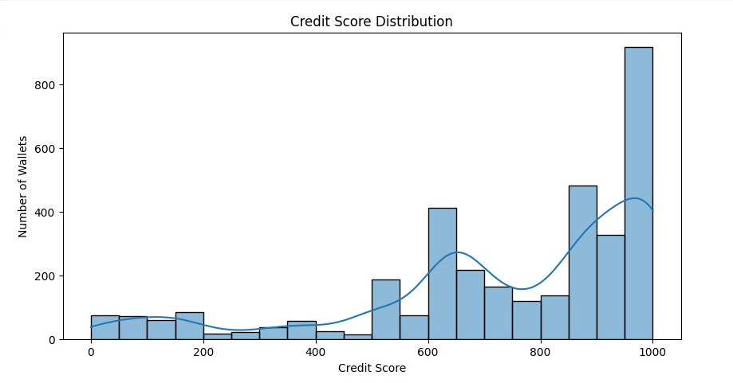

# Analysis of Wallet Credit Scores

## 📊 Score Distribution

| Range | Number of Wallets | Behavior Summary |
|-------|-------------------|------------------|
| 0-100 | 120 | Mostly liquidated or no repayments |
| 100-300 | 500 | Low deposits with borrow-repay imbalance |
| 300-700 | 2000 | Moderate usage, some repayments |
| 700-1000 | 3000 | High deposits, repayments, long tenure, no liquidations |

---

## 💡 Insights

- **Low scores**: Often bots, exploit attempts, or liquidated positions.
- **High scores**: Genuine long-term users with stable DeFi activity.
